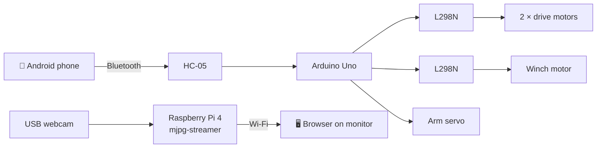
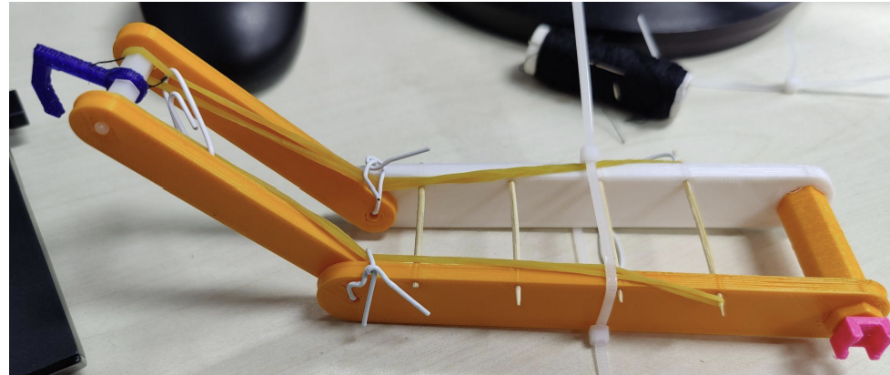

<h1 align="center">🏗️ Lecraneboi</h1>

  <b>A Bluetooth-controlled robot car with a string-driven crane claw and a live FPV camera stream</b> 
  

---

## Project Overview

**Lecraneboi** is a manually operated robot car built to drive up to an object, hook it with a crane-style claw, and carry it to a destination. The operator drives it from an Android phone over Bluetooth while watching a live webcam feed streamed from the robot over Wi-Fi.

The project began as an autonomous robot using OpenCV on a Raspberry Pi. Without IR or distance sensing available, the team pivoted to manual first-person-view (FPV) control to deliver a reliable competition build.

### How it works

The robot runs two independent subsystems:

| Subsystem | Hardware | Role |
|-----------|----------|------|
| **Control** | Arduino Uno, HC-05, 2 × L298N, 3 DC motors, servo, battery pack | Receives phone commands; drives the wheels and operates the claw |
| **Vision** | Raspberry Pi 4B, USB webcam, power bank | Streams live video to a browser on the same Wi-Fi network |

### Chassis

 **Footprint:** 200 × 140 mm, stacked in two layers to stay within the competition size limit
**Lower layer (3 mm laser-cut acrylic):** drive motors, wheels, and battery pack underneath to keep the centre of gravity low; Arduino, Raspberry Pi, drive motor driver, power bank, and kill switch on top
  - **Upper layer (1.5 mm hard cardboard):** webcam, claw servo, winch motor and its driver, and the crane claw
  - **Drive:** differential drive with two DC-motor wheels and an omni wheel for tight turns; turning is done by running the wheels at different speeds
  - **Camera placement:** mounted at the rear so both the path ahead and the claw stay in frame

### Crane claw

A six-part 3D-printed mechanism (hexagonal shaft, two long arms, two short arms, hook) with two degrees of motion:

1. **Elevation** — a servo rotates the hexagonal shaft to raise and lower the long arms.
2. **Hook actuation** — a DC motor with a 3D-printed winch pulls a string that draws the hook back toward the car to catch the object.
3. **Return** — two rubber bands pull the hook back out when the winch releases; wooden rods between the long arms stop them flexing under the band tension.

---

### 🔧 Mechanical design & fabrication

- Designed the robot framework in **Fusion 360**, including the overall structure, component layout, and dimensions needed to fit two layers of hardware within the competition size limit
- Designed the **acrylic base plate** for laser cutting, with mounting holes for standoffs, the omni wheel, and the battery pack, and a slot for zip-tying the drive motors
- Designed and **3D printed the crane claw**, its supports, and the connectors
- Came up with the concept for the **3D-printed hexagonal coupler** that joins each drive motor to its wheel
- **Assembled** the full robot and claw mechanism

### ⚡ Electronics & firmware

- Designed the **Arduino control circuit**: Arduino Uno, two L298N motor drivers, three DC motors, a servo, and the HC-05 Bluetooth module
- Wrote the **Arduino firmware** in the Arduino IDE to control the drive wheels, the claw servo, and the winch motor
- Integrated the **HC-05 Bluetooth module** so the robot could be driven and the claw operated from an Android phone

### 🎥 Vision system

- Set up the **Raspberry Pi 4**, installing OpenCV, NumPy, and CMake for the initial autonomous-control approach
- Conceived and implemented the **live video stream** using mjpg-streamer, viewed on an external monitor over Wi-Fi
- Operated the robot using the FPV feed

### Skills demonstrated

`Fusion 360` · `3D printing` · `Laser cutting` · `Mechanism design` · `Circuit design` · `Motor drivers (L298N)` · `Arduino C++` · `Bluetooth serial (HC-05)` · `Raspberry Pi / Linux` · `mjpg-streamer` · `OpenCV setup` · `System integration`

---

